```mermaid
timeline
    title The Path So Far
    section Early Days
        2022 : 🎯 Intern at Ynamly Geljek
             : First "it works on my machine" moment
             : Discovered my passion for code
    section Growth
        2022-2024 : 💼 Frontend Developer
                  : Mastered React ecosystem
                  : Shipped production apps
    section Backend Era
        2024 : ⚙️ Backend at Jahankeshde Hyzmat
             : Django & RESTful APIs
             : Database architecture
    section Giving Back
        2024-Now : 🎓 Mentor at Algoritm
                 : Teaching Python, React, Flutter
                 : Building the next generation
```

<div align="center">

<!-- ANIMATED HEADER -->


<!-- TYPING ANIMATION -->
<a href="https://git.io/typing-svg">
  
</a>

<br/>

<!-- PROFILE BADGES -->
<a href="https://github.com/TheSeydiCharyyev">
  
</a>
<a href="https://github.com/TheSeydiCharyyev?tab=followers">
  
</a>
<a href="https://github.com/TheSeydiCharyyev?tab=repositories">
  
</a>
<a href="mailto:seydi.charyev@gmail.com">
  
</a>

</div>

---

<!-- METRICS HEADER -->
<div align="center">
  
</div>

---

<!-- ABOUT ME SECTION -->
##  About Me


```typescript
const seydi: Developer = {
  location: "Mary, Turkmenistan 🇹🇲",
  role: "Fullstack Engineer & Mobile Developer",
  company: "Algoritm Education Center",
  position: "Mentor & Lead Instructor",

  passion: "Teaching the next generation",
  motto: "I just want to be successful enough to help people",

  currentlyLearning: ["Cloud Architecture", "System Design"],
  askMeAbout: ["React", "Flutter", "Django", "Mobile Dev"],

  funFact: "Started with Delphi, now mass-producing apps with Flutter"
};
```

<br clear="right"/>

---

<!-- ACHIEVEMENTS -->
##  Achievements

<div align="center">
  
</div>

---

<!-- CODING HABITS -->
##  Coding Habits

<div align="center">
  
</div>

---

<!-- LANGUAGES -->
##  Languages & Technologies

<div align="center">
  
</div>

### Tech Stack

<details open>
<summary><b>💻 Programming Languages</b></summary>
<br/>
<p align="center">
<a href="https://skillicons.dev">

</a>
</p>
</details>

<details open>
<summary><b>🎨 Frontend</b></summary>
<br/>
<p align="center">
<a href="https://skillicons.dev">

</a>
</p>
</details>

<details open>
<summary><b>⚙️ Backend</b></summary>
<br/>
<p align="center">
<a href="https://skillicons.dev">

</a>
</p>
</details>

<details open>
<summary><b>📱 Mobile</b></summary>
<br/>
<p align="center">
<a href="https://skillicons.dev">

</a>
</p>
</details>

<details open>
<summary><b>🗄️ Database & Cloud</b></summary>
<br/>
<p align="center">
<a href="https://skillicons.dev">

</a>
</p>
</details>

<details open>
<summary><b>🛠️ Tools</b></summary>
<br/>
<p align="center">
<a href="https://skillicons.dev">

</a>
</p>
</details>

---

<!-- GITHUB STATS -->
##  GitHub Analytics

<div align="center">
  
  
</div>

<div align="center">
  
</div>

<!-- LINES OF CODE -->
<div align="center">
  
</div>

---

<!-- ACTIVITY GRAPH -->
##  Contribution Graph

<div align="center">
  
</div>

---

<!-- RECENT ACTIVITY -->
##  Recent Activity

<div align="center">
  
</div>

---

<!-- CODE SNIPPET -->
##  Random Code Snippet

<div align="center">
  
</div>

---

<!-- STARGAZERS -->
##  Stargazers

<div align="center">
  
</div>

---

<!-- TROPHIES -->
##  GitHub Trophies

<div align="center">
  
</div>

---

<!-- PEOPLE -->
##  Community

<div align="center">
  
</div>

---

<!-- MY JOURNEY -->
##  My Journey



---

<!-- LANGUAGES I SPEAK -->
##  Languages I Speak

<div align="center">

|  |  |  |  |  |  |
|:---:|:---:|:---:|:---:|:---:|:---:|
| **Turkmen** | **Russian** | **English** | **German** | **French** | **Chinese** |
| `Native` | `C1` | `B2` | `A2` | `A2` | `HSK2` |
| *Home* | *Work* | *Code* | *Learning* | *Learning* | *Learning* |

</div>

---

<!-- QUOTE -->
##  Random Dev Quote

<div align="center">
  
</div>

---

<!-- SNAKE -->
##  Watch the Snake Eat My Contributions

<div align="center">
  <picture>
    <source media="(prefers-color-scheme: dark)" srcset="https://raw.githubusercontent.com/TheSeydiCharyyev/TheSeydiCharyyev/output/github-snake-dark.svg" />
    <source media="(prefers-color-scheme: light)" srcset="https://raw.githubusercontent.com/TheSeydiCharyyev/TheSeydiCharyyev/output/github-snake.svg" />
    
  </picture>
</div>

---

<!-- SPOTIFY -->
##  Coding Vibes

<div align="center">

[](https://github.com/kittinan/spotify-github-profile)

</div>

---

<!-- CONNECT -->
##  Let's Connect

<div align="center">

[](mailto:seydi.charyev@gmail.com)
[](https://linkedin.com/in/seydi-charyyev)
[](https://theseydicharyyev.github.io/portfolio/)
[](https://github.com/TheSeydiCharyyev)
[](https://t.me/TheSeydiCharyyev)

</div>

<br/>

<div align="center">

### 💭 *"I just want to be successful enough to help people."*

<br/>

**Thank you for visiting! Let's build something amazing together.**


</div>

---

<div align="center">
  <sub>🤖 This README is auto-generated with <a href="https://github.com/lowlighter/metrics">lowlighter/metrics</a></sub>
</div>
